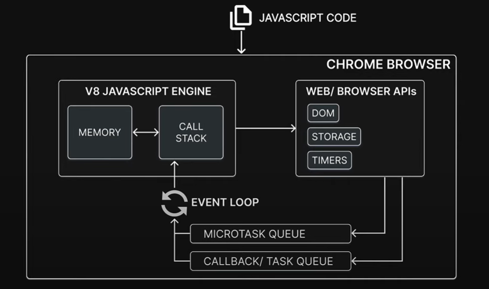

# JavaScript Runtime

> JavaScript Runtime is an environment which provides all the necessary components in order to use and run JavaScript program
>
> Every browser has a JavaScript Engine
>
> A JavaScript is one component in the JavaScript Runtime
>
> What else does the JavaScript Runime consist of ?

# Table of contents

- [Chrome browser JavaScript Runtime](#chrome-browser-javascript-runtime)
- [Concept so far](#concept-so-far)

# Chrome browser JavaScript Runtime

Chrome browser as an example

- The JavaScript code we write is executed in Chrome's JavaScript Runtime which consists of the following components:
  - JavaScript Engine
  - Web APIs
  - Queue
  - Event loop
- The JavaScript Engine is the V8 Engine which executes JavaScript code it consists of:
  - A call stack where JavaScript code gets executed
  - A heap which is nothing but memory to store all variables that a JavaScript application needs
- Web APIs:
  - DOM
  - Timer such as set timeout and set interval, promises
  - Browser storage
  - ...etc ( which add extra functionality to the JavaScript Engine but are not part of JavaScript language itself )

> [!NOTE]
> All Web APIs are provided by the browser

- Queue are where asynchronous tasks weight before they can be executed

- Event loop that ensures async tasks are executed in the right order

> [!NOTE]
> This at a very high level is the overview of the JavaScript Runtime in the browser

> [!IMPORTANT]
> With this visualization is that just a JavaScript Engine is not sufficient in the grand scheme of things the engine itself can execute ECMAScript but JavaScript as we know it is ECMAScript plus all the Web APIs like ( console log, set timeout, set interval, DOM APIs, ...etc )
>
> To run the JavaScript code we write every day, a browser needs not just a JavaScript Engine but a JavaScript Runtime

# Concept so far

- ECMAScript
- JavaScript Engine
- JavaScript Runtime

[Back to top](#top)
